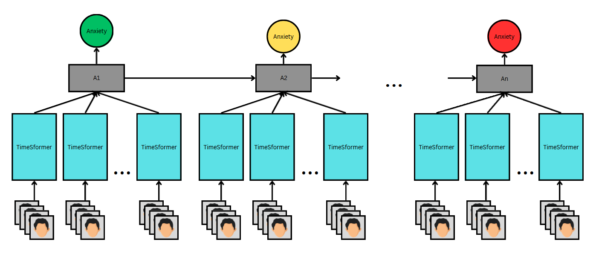

# MIND
Mental health Identification using No-label Distillation

## Overview
MIND is a machine learning model that combines META's DINO model and a Long Short-Term Memory (LSTM) network. This research seeks to classify mental states that are more time-variant in nature. This has been a challenge in past literature for a multitude of reasons:
- Previous works only sought to classify based on a set of 7-9 basic emotions (datasets only provide so much information). These labels are too broad to accurately describe something as complex as depression or anxiety. They do not encompass the entire emotion spectrum, nor do they capture the nuance of complex emotion. Common labels include:
    - $\textcolor{red}{Anger}$
    - $\textcolor{orange}{Surprise}$
    - $\textcolor{yellow}{Happy}$
    - $\textcolor{lime}{Fear}$
    - $\textcolor{blue}{Sad}$
    - $\textcolor{orchid}{Disgust}$
    - $\textcolor{purple}{Contempt}$
    - $\textcolor{gray}{Neutral}$  

- Emotions are defined differently from greater psychological issues. Being either happy and anxious can both be short-term psychological symptoms not indicating anything larger. However, something like Generalized Anxiety Disorder (GED) can't be seen as instantaneous. Dually, "happy," in terms of an image or video classification, can be from a single frame or set of images being strong enough probability-wise to force a machine learning model to interpret the data as a single emotion. 


## Previous Work
### DINO and Self-Supervision
Among the list of improvements to base models that exist for transformers, self-supervision is perhaps one of the largest improvements. Put simply, the act of self-supervision is training without labels, creating a "black box" of sorts for the training, where the learnable parameters are at their lowest point of explainability. That being said, this provides a unique benefit for transformers. Self-supervision allows a transformer to teach itself attention scores in a way that vastly outperforms simple classifier scoring-based methods. The model used here is Meta's DINO model (Self-Distillation with No Labels).  

Self-distillation refers to the act of a student network (a model that has less information and guesses the output) learning from a teacher network (a model that "knows the answer" since it's given more information) and no-label is referring to there being no dataset labels used for training. The student is fed information such as images with local crops, distorted views, etc., while the teacher sees the whole image. For the teacher, it's mostly important that the output remains in a normal distribution, but the errors are not propagated, that is only for the student since it's the one learning.

Meta showed that this is an effective alternative to supervision. In the following image, it is clear that attention learned from self-supervision is much more clean and intuitive to what one would expect to be important in any image:
<figure style = "text-align: center;">
  
  <figcaption>Figure x: DINO versus normal supervision attention mapping. </figcaption>
</figure>


### TimeSformer
While Meta's DINO model works with video to an extent, there is room for experimentation. TimeSformer utilizes temporal-spatial relationships between video frames and 

### Linformer
One major improvement to model performance that can be made with any transformer based model is the use of linear complexity in the computation of self-attention. As shown by Facebook AI, now Meta, the calculations for self-attention result in a low rank matrix, meaning that the calculation can be approximated. More specifically, the self-attention calculation for context mapping:
$$ P = softmax [\frac{QW_i^Q(KW_i^K)^{\top}}{\sqrt{d}}]$$
The equation within the brackets  can be approximated using learnable mapping matrices which is proven in the original paper [Linformer: Self-Attention with Linear Complexity](https://arxiv.org/pdf/2006.04768). A more pictoral description is shown below:
<figure style = "text-align: center;">
  
  <figcaption>Figure x: . </figcaption>
</figure>


## Model
Mental health Identification with No-label Distillation (MIND) utilizes the self-supervision of DINO with the time domain utilization of the LSTM. 

<figure style = "text-align: center;">
  
  <figcaption>Figure x: Mind Model. N transformers being fed simultaneously into one cell of the LSTM. </figcaption>
</figure>


## How to Use

```
> git clone https://github.com/rileycyeoman/MIND.git
```


